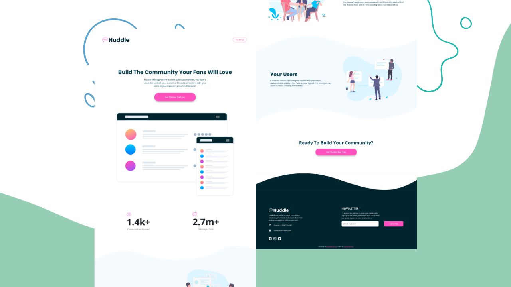

# Frontend Mentor - Huddle landing page with curved sections solution

This is a solution to the [Huddle landing page with curved sections challenge on Frontend Mentor](https://www.frontendmentor.io/challenges/huddle-landing-page-with-curved-sections-5ca5ecd01e82137ec91a50f2). Frontend Mentor challenges help you improve your coding skills by building realistic projects. 

## Table of contents

- [Overview](#overview)
  - [The challenge](#the-challenge)
  - [Screenshot](#screenshot)
  - [Links](#links)
- [My process](#my-process)
  - [Built with](#built-with)
  - [What I learned](#what-i-learned)
  - [Continued development](#continued-development)
- [Author](#author)

## Overview

### The challenge

Users should be able to:

- View the optimal layout for the site depending on their device's screen size
- See hover states for all interactive elements on the page

### Screenshot



### Links

- Solution URL: [Github repository](https://github.com/Theuz1nh0/Huddle-landing-page)
- Live Site URL: [Github pages](https://theuz1nh0.github.io/Huddle-landing-page/)

## My process

### Built with

- Semantic HTML5 markup
- CSS custom properties
- Flexbox
- CSS Grid
- Mobile-first workflow
- [Bootstrap](https://getbootstrap.com/) - CSS framework

### What I learned

everything i coded with bootstrap i'm still learning, every class like:

```html
<div class="container-fluid pt-xxl-4"></div>
<a class="btn btn-outline-pink rounded-5 text-capitalize
          py-1 px-3 py-xl-2 px-xl-4 fs-xxl-6">something</a>
```

### Continued development

I'm going to continue studying bootstrap and do more projects with bootstrap, I want to know more ways to use bootstrap in a project and better practices for coding with it

## Author

- Github - [Theuz1nh0](https://github.com/Theuz1nh0)
- Frontend Mentor - [@Theuz1nh0](https://www.frontendmentor.io/profile/Theuz1nh0)
- Linkedin - [theuz1nh0](https://www.linkedin.com/in/theuz1nh0/)
